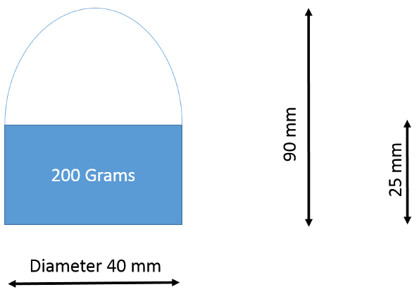
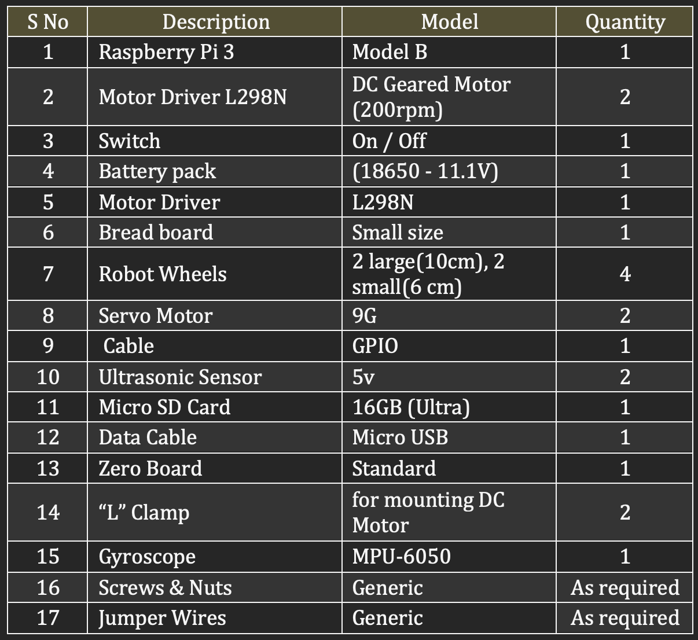

# mechatronics-and-control-systems

## Project theme and General Guideline Mechatronics and Control Systems (MED412) Monsoon 2018

The mechatronics project is meant to develop working knowledge of electromechanical intelligent systems using the hardware provided and within the strict constraints of the project theme. 
Projects are assigned to students in batches of four. Each team shall receive a project kit and an objective. Creative freedom is given with respect to execution-bonus points going to out of the box thinking. The project will be divided into 4 sections that would be evaluated in 4 rounds of presentations held during class hour-5 minutes per presentation. 

1. Round 1-concept and overall picture,
2. Round 2-Kinematics and electronics, 
3. Round 3-coding. 
4. The culminating presentation will be demonstration of the working model. PPT is optional.

Each round is given equal weightage. Marks awarded in each round is final, no marks shall be awarded to earlier rounds based on current progress. Penalties are steep for missing deadlines (can be as high as 50% for a given round as those submitting/presenting later get an unfair advantage). Project presentations will have to be all inclusive putting as many details concisely as possible. 
  
### Theme:
1. The theme for this project is an obstacle course that has to be negotiated by a wheeled robot.
2. Objectives/constraints:

(A) To lift a payload weighing 0.2 Kg from a specific spot on the obstacle course and transport it to the Finish point. Payload has dimensions as shown below.

 
(B) The obstacle course is the size of 2 standard large tables found in Mechatronics lab. Visit lab to get an idea. Obstacles would be cuboidal in shape. The robot may either avoid the obstacles-there would be convoluted open spaces in between the obstacles- or move over the obstacles. Height of the obstacles won’t exceed 4.5 cm. The final obstacle course itself will be available for viewing in November. This the robot has to do independently, controlling a robot remotely will disqualify you. Remote control is allow only for starting and stopping the robot.

(C) Mechanism for lifting should utilize only the servo motors provided with the kit. 

(D) It was originally decided that hooks would be provided for grasping the payload, however this would seriously limit the options with respect to design. Therefore the grasping mechanism design has been left open to the students. 

### Grading scheme:
1. The project carries 40 Marks divided equally among the four presentations. However bonus points are awarded for intelligent questions raised in class and there are penalties for duplication of work. In case your design is similar to several others then based on similarity penalties are levied. Conversely original designs/algorithms are awarded bonus points. Special bonus is awarded to teams that have used intelligent control techniques/ machine learning and also for teams that have managed to map the surroundings and display it. Such bonuses can be as high as 10 Marks each.
2. Plagiarism will be dealt with severely.
3. If a team or person as a result of bonuses earned crosses 40 Marks for the project the grading scheme for the entire class will be changed to a relative grading scheme only for the project component. Therefore it should be noted that in the end the marks may not add up due to relative nature of grading. Will try to introduce a relative grade component in black board for project alone.      
4. The total value of bonus points earned by an individual for asking questions during presentations will be 5 Marks.
5. Three marks will be held back from each presentation to see if the team has followed through on the concepts presented. 

#### Components Used
